# BobForge Workflow & Architecture

This document provides visual representations of BobForge's workflows and architecture.

---

## 🔄 Complete User Workflow

```mermaid
graph TD
    A[Start: Landing Page] --> B[Create New Project]
    B --> C[Paste API Documentation]
    C --> D[Click Analyze]
    D --> E[Parser Service Extracts Endpoints]
    E --> F[View API Analysis Page]
    F --> G[Review Extracted Endpoints]
    G --> H[Click Generate Tools]
    H --> I[Tool Planner Creates MCP Tools]
    I --> J[View MCP Tool Plan Page]
    J --> K[Review Generated Tools]
    K --> L[Click Assess Risk]
    L --> M[Risk Engine Evaluates Tools]
    M --> N[View Risk Review Page]
    N --> O[Review Risk Levels & Policies]
    O --> P[Click Generate Code]
    P --> Q[MCP Generator Creates Server]
    Q --> R[View Code Preview Page]
    R --> S[Browse Generated Files]
    S --> T[Click Test in Playground]
    T --> U[Agent Playground]
    U --> V{User Query}
    V --> W[Agent Selects Tool]
    W --> X{Risk Check}
    X -->|Low/Medium| Y[Execute Tool]
    X -->|High/Critical| Z[Request Approval]
    Z --> AA{Approval Decision}
    AA -->|Approved| Y
    AA -->|Rejected| AB[Show Rejection]
    Y --> AC[Display Result]
    AC --> AD[Continue Testing or Export]
    AD --> AE[Click Export]
    AE --> AF[Download ZIP Package]
    AF --> AG[End: Deploy MCP Server]
```

---

## 🏗️ System Architecture

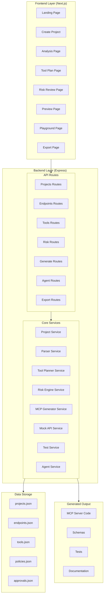

---

## 🔄 Data Flow: API Documentation to MCP Server

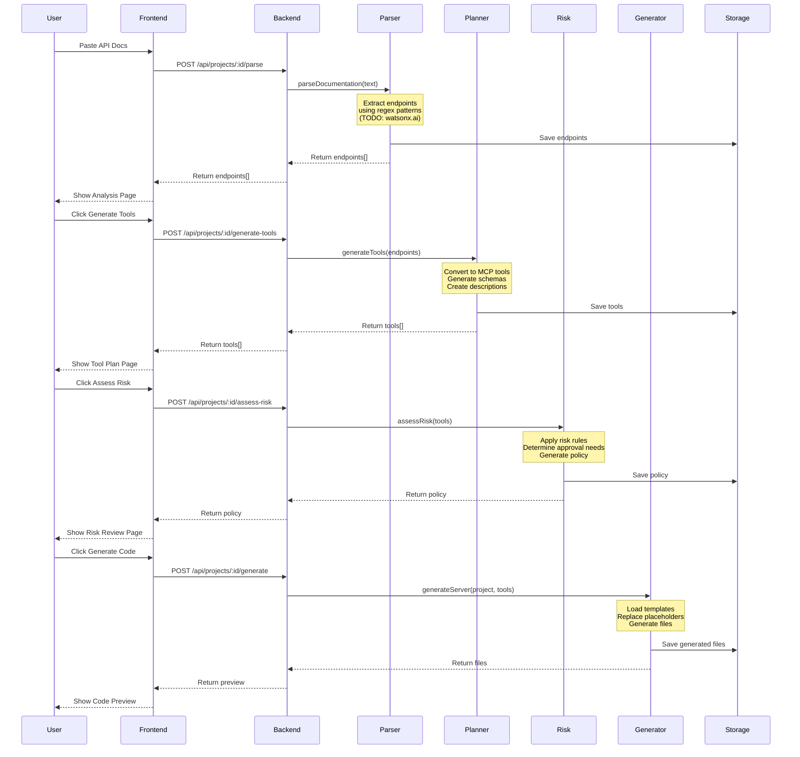

---

## 🎮 Agent Playground Flow

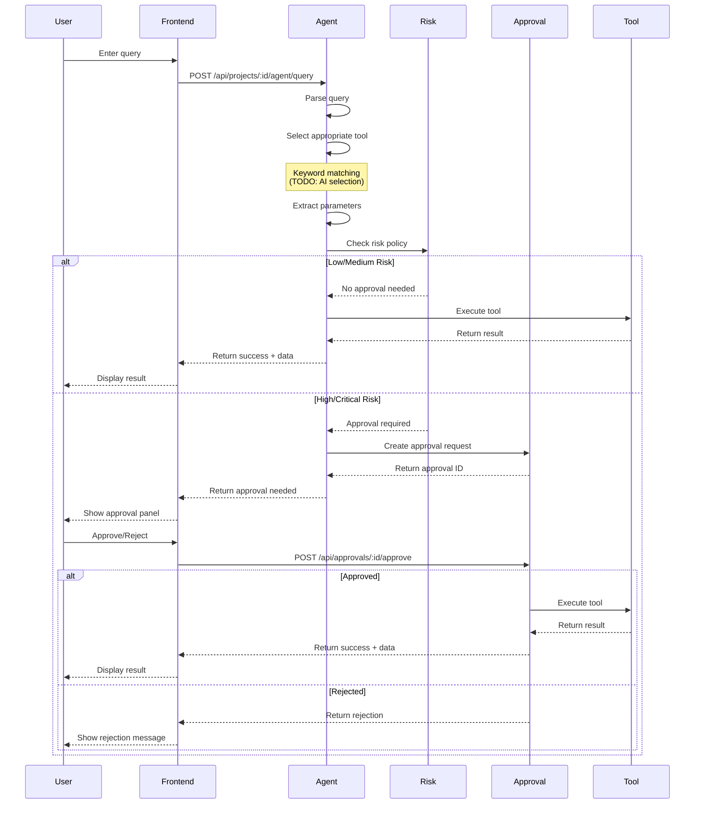

---

## 🛡️ Risk Assessment Logic

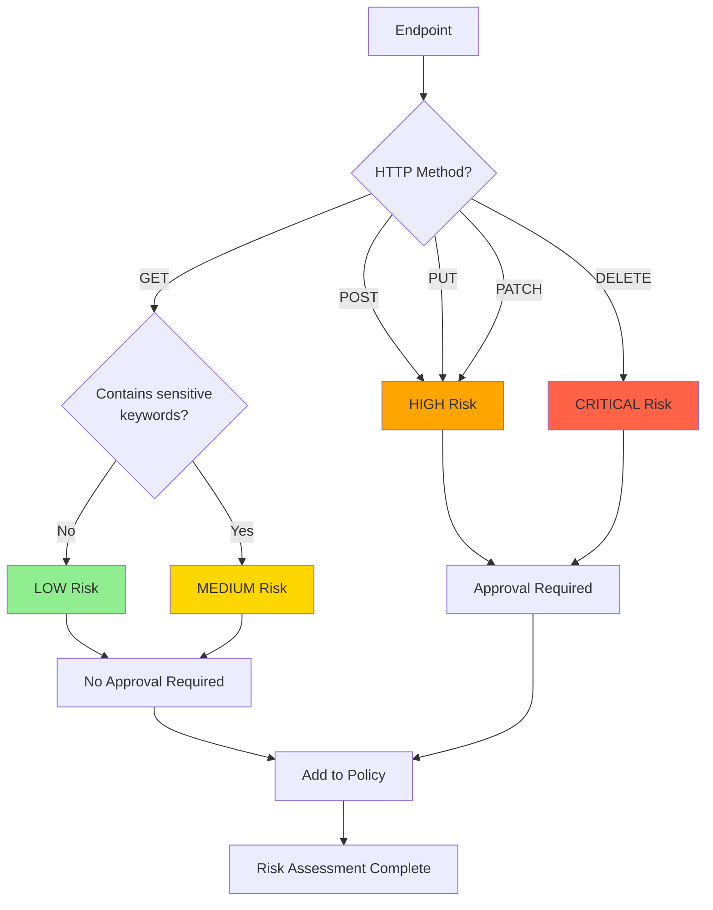

---

## 📦 MCP Server Generation Process

```mermaid
flowchart LR
    subgraph Input
        Tools[MCP Tools]
        Policy[Risk Policy]
        Project[Project Info]
    end
    
    subgraph Templates
        ServerTpl[server.template.ts]
        ToolTpl[tool.template.ts]
        SchemaTpl[schema.template.ts]
        TestTpl[test.template.ts]
        ReadmeTpl[readme.template.md]
    end
    
    subgraph Generator["MCP Generator Service"]
        Load[Load Templates]
        Replace[Replace Placeholders]
        Validate[Validate Code]
        Structure[Create File Structure]
    end
    
    subgraph Output
        Server[index.ts]
        ToolFiles[tools/*.ts]
        Schemas[schemas/index.ts]
        Tests[tests/*.test.ts]
        Readme[README.md]
        Package[package.json]
        Config[tsconfig.json]
        PolicyFile[policy.json]
    end
    
    Input --> Generator
    Templates --> Generator
    Generator --> Output
```

---

## 🔐 Approval Workflow

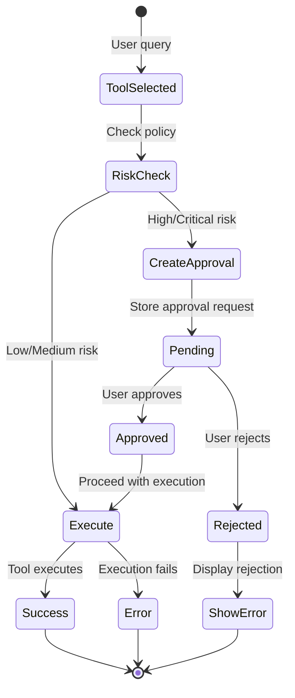

---

## 📊 Data Model Relationships

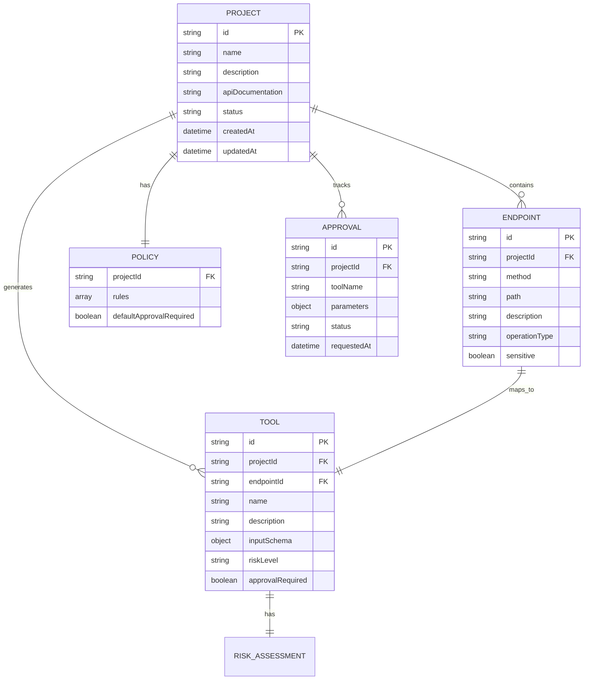

---

## 🎯 Feature Implementation Priority

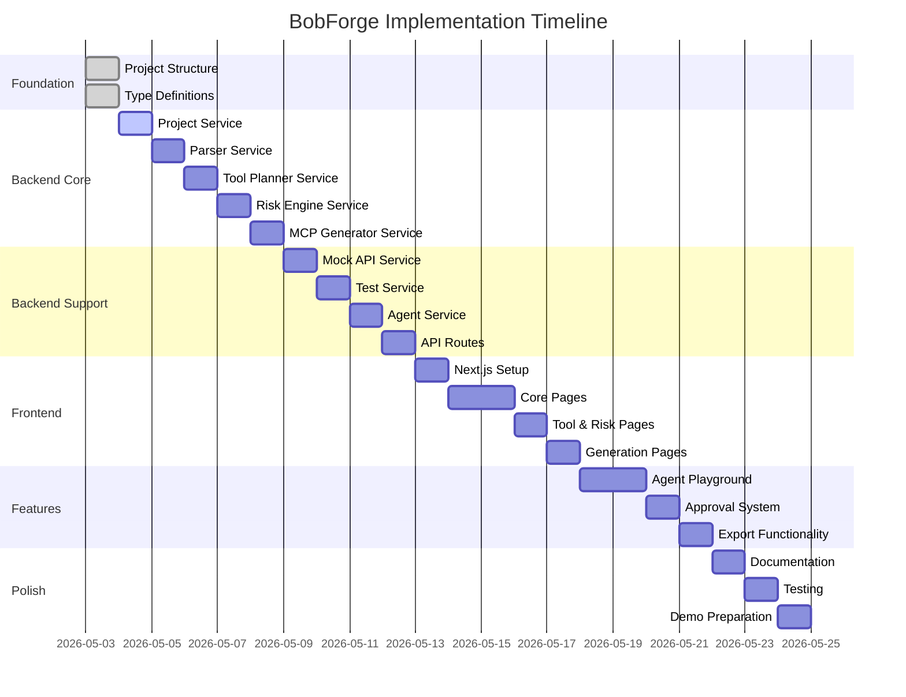

---

## 🔍 Component Interaction Map

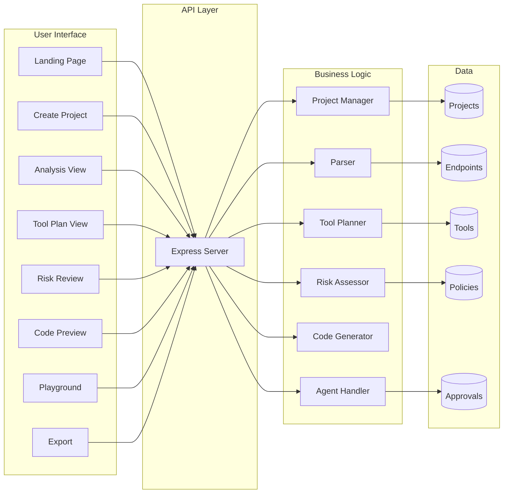

---

## 🚀 Deployment Architecture

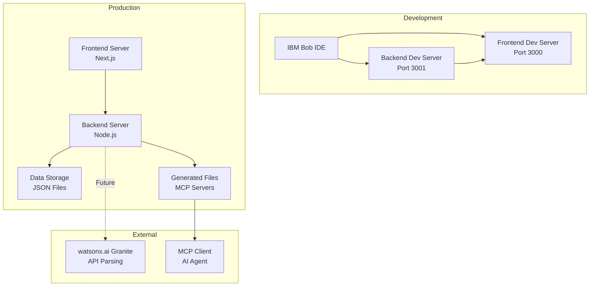

---

## 📝 Key Decision Points

### 1. When to Use Mock vs Real Data
- **Development**: Use mock data for all services
- **Demo**: Use mock HR data
- **Production**: Replace with real API calls

### 2. When to Request Approval
- **LOW Risk**: Execute immediately
- **MEDIUM Risk**: Execute immediately (log only)
- **HIGH Risk**: Request approval
- **CRITICAL Risk**: Request approval + additional verification

### 3. When to Generate Code
- After risk assessment is complete
- When user explicitly requests generation
- Before entering playground mode

### 4. When to Switch Modes
- **Plan Mode**: For initial setup and architecture
- **Code Mode**: For implementation
- **Ask Mode**: For questions and clarifications

---

## 🎓 Learning Path

For developers new to the project:

1. **Start Here**: Read README.md
2. **Understand Architecture**: Review TECHNICAL_SPEC.md
3. **Follow Implementation**: Use IMPLEMENTATION_GUIDE.md
4. **Visualize Flow**: Study this WORKFLOW.md
5. **Start Coding**: Begin with project structure setup

---

## 🔧 Troubleshooting Flowchart

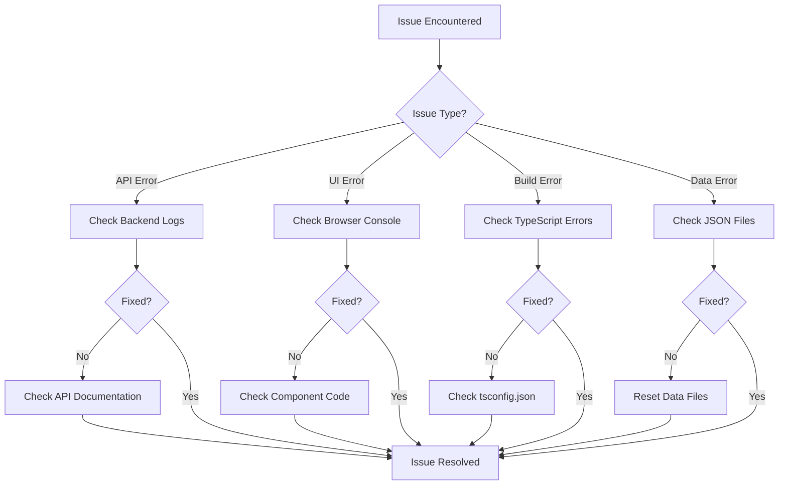

---

**This workflow document provides visual guides for understanding BobForge's architecture and processes. Refer to it during development and when explaining the system to others.**